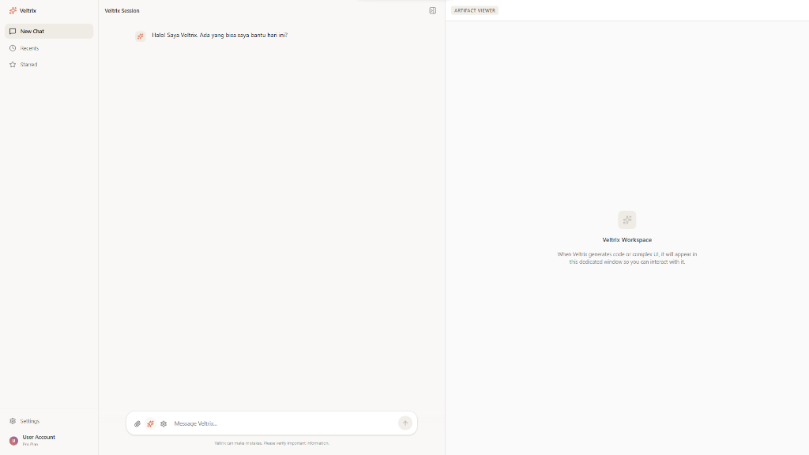

# 🚀 AI Veltrix

<p align="center">
  
</p>

**AI Veltrix** is a powerful next-generation AI assistant platform built with a hybrid intelligence model. It seamlessly alternates between high-performance cloud reasoning (via Groq) and private, lightweight local execution (3B parameters) to ensure you always have access to intelligence, even when offline or rate-limited.

---

## 🖥️ UI Preview



---

## ✨ Key Features

- ☁️ **Hybrid Cloud/Local Intelligence**: Uses `openai/gpt-oss-120b` for complex reasoning and automatically falls back to a 3B Local LLM if the cloud is unavailable.
- 🔍 **Real-time Web Search**: Integrated `browser_search` tool for both cloud and local models to fetch the latest information.
- 📊 **Source Tracking & Latency**: Every response includes metadata showing which model was used, the origin (Cloud/Local), and exact response latency in ms.
- 💾 **Persistent Memory**: Full conversation history stored in a local SQLite database with unique ID tracking.
- 📎 **File Integration**: Support for PDF and text file context injection directly into chat sessions.
- 🎨 **Premium Glassmorphism UI**: A stunning, modern React interface with dark/light modes and floating controls.

---

## 🛠️ Technology Stack

- **Backend**: Node.js, Express, TypeScript, SQLite
- **Frontend**: React 18, Vite, Tailwind CSS, Lucide Icons
- **AI Services**: Groq API, LM Studio / Ollama (Local)

---

## 🚀 Getting Started

### 1. Prerequisites
- Node.js (v18+)
- Local LLM Runner (e.g., LM Studio or Ollama) running on port `1234`

### 2. Installation
```bash
# Clone the repository
git clone https://github.com/harshiINF/AI-Veltrix-App.git
cd AI-Veltrix-App

# Install dependencies for both Backend & Frontend
npm install
cd frontend-claude-app && npm install
```

### 3. Configuration
Copy the `.env.example` file to `.env` and fill in your keys:
```bash
cp .env.example .env
```

### 4. Running the App
```bash
# Start Backend (from root)
npm run dev

# Start Frontend (from /frontend-claude-app)
npm run dev
```

---

## 🔒 Security & Privacy

- **Safe Dotenv**: All API keys are stored in `.env` and strictly ignored by Git.
- **Local Fallback**: Sensitive queries can be forced to run locally using the **Force Local** toggle in the UI.

---

## 🤝 Contributing

Contributions are welcome! Please feel free to submit a Pull Request.

---

## 📄 License

MIT License - Copyright (c) 2026 harshiINF

---

<p align="center">
  <i>"Empowering Intelligence, Anywhere, Anytime."</i>
</p>
